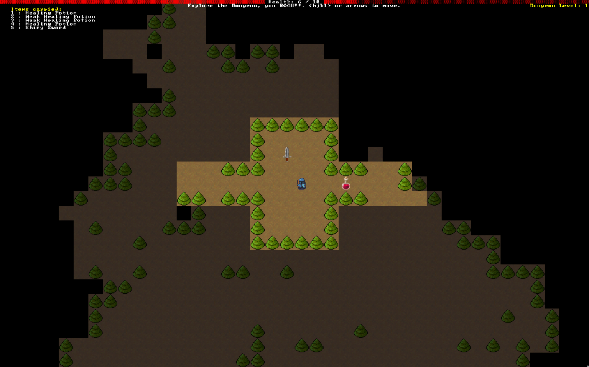

# R O G U ! !

A console-ish, [rogue](https://en.wikipedia.org/wiki/Rogue_(video_game))-ish
game written in Rust, mostly by following [*Hands-on
Rust*](https://hands-on-rust.com/) by [Herbert
Wolverson](https://www.bracketproductions.com/) (highly recommended, btw, along
with his free [Roguelike
Tutorial](https://bfnightly.bracketproductions.com/rustbook/)).

No long-term intentions with this one, but I've enjoyed writing a game using Rust
and an Entity Component System library
([legion](https://crates.io/crates/legion)) along with Mr. Wolverson's
[bracket-lib](https://crates.io/crates/bracket-lib) crate.

## To-Do

**At this point (0.1.0 release), all of the book features have been implemented!**

I *would* like to render the game with ANSI in the terminal using
[crossterm](https://crates.io/crates/crossterm) and perhaps make it the first
"door game" for my [moonbase BBS](https://github.com/sdsalyer/moonbase)
project.

Otherwise, there's a few more things that could be interesting to pursue
(in no particular order):

-[ ] A* pathfinding
-[ ] Animations & Particles
-[ ] Ranged combat and/or spells
-[ ] Expanded enemies, items, and levels
-[ ] Explore additional procgen algorithms (Wave Function Collapse, etc.)
-[ ] Save state
